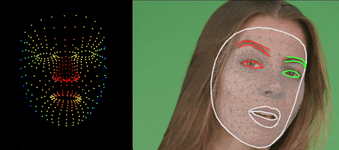

# Mediapipe-Extended
Mediapipe for Python with extended solution support. The aim of this repository is to add [solutions](https://google.github.io/mediapipe/solutions/solutions.html) to mediapipe that are not included in the original mediapipe Python package.  This repository just provides the build script and examples for mediapipe-extended. The build script uses the [face-geometry-python](https://github.com/cansik/mediapipe/tree/face-geometry-python) branch to build the python wheel package.

### Installation
Until a PyPi package is released, use pip to install the wheel directly.

```
pip install -r requirements.txt
pip install https://github.com/cansik/mediapipe-extended/releases/download/v0.9.1/mediapipe_extended-0.9.1-cp39-cp39-macosx_12_0_arm64.whl
```

⚠️ At the moment only the following packages have been [prebuilt](https://github.com/cansik/mediapipe-extended/releases/tag/v0.9.1). Support for all major platforms like Windows, MacOS and Linux is coming soon.

- Linux x86-x64 (`3.9`)
- MacOS Intel (`3.9`)
- MacOS ARM64 (`3.8`, `3.9`, `3.10`, `3.11`)

### Face Geometry
The Face Geometry solution allows the head transformation matrix to be recovered from the landmark detection. This enables face effects or undistorted landmark analysis.

#### Augmented Reality
Project filters onto the face by using the geometry information.


```bash
python examples/FaceGeometryExample.py
```

#### Measure Distance
Measure distances between landmarks without the perspective distortion.



```bash
python examples/NeutralFaceLandmarkExample.py
```

### Build
To create a wheel package, set up your computer as described in [Mediapipe: Getting Started](https://google.github.io/mediapipe/getting_started/python.html#mediapipe-python-framework) and run the following command (Powershell Core is required).

```bash
pwsh tools/build.ps1
```

### About
Apache-2.0 license - Copyright (c) 2023 Florian Bruggisser