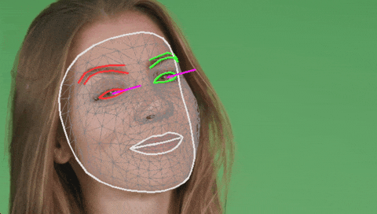

# Mediapipe-Extended
Mediapipe for Python with extended solution support. The aim of this repository is to add [solutions](https://google.github.io/mediapipe/solutions/solutions.html) to mediapipe that are not included in the original mediapipe Python package.

This repository just provides the build script and examples for mediapipe-extended. The build script uses the [face-geometry-python](https://github.com/cansik/mediapipe/tree/face-geometry-python) branch to build the python wheel package.

### Installation
Until a PyPi package is released, use pip to install the wheel directly.

```
pip install -r requirements.txt
pip install https://github.com/cansik/mediapipe-extended/releases/download/v0.9.1/mediapipe_extended-0.9.1-cp39-cp39-macosx_12_0_arm64.whl
```

⚠️ At the moment only MacOS Arm64 wheel package for Python `3.9` is pre-built. MacOS Intel, Windows and Linux support is coming soon.

### Face Geometry
The Face Geometry solution allows the head transformation matrix to be recovered from the landmark detection. This enables face effects or undistorted landmark analysis.



```bash
python examples/FaceGeometryExample.py
```

### Build
To create a wheel package, set up your computer as described in [Mediapipe: Getting Started](https://google.github.io/mediapipe/getting_started/python.html#mediapipe-python-framework) and run the following command (Powershell Core is required).

```bash
pwsh tools/build.ps1
```

### About
Apache-2.0 license - Copyright (c) 2023 Florian Bruggisser